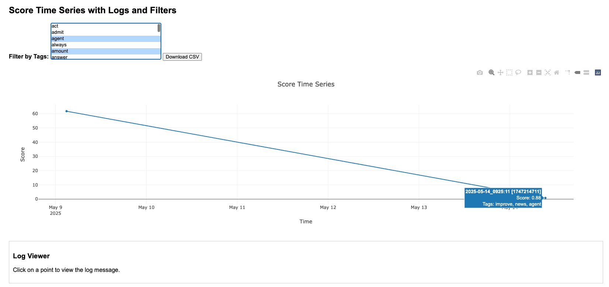

# activity_monitoring

## activity_monitoring_with_html_dashboard_tools

📌📌 Create a file named score_time_series.html in the working directory. You can open it in any browser or share it as a self-contained interactive chart.

In mac, hold [command] and select keywords to filter. 

