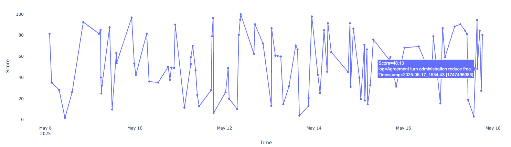
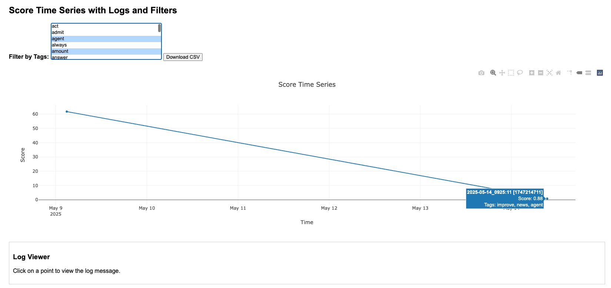

# python_activity_monitoring

## activity_monitoring

📌 Faker creates random logs, timestamps, UUIDs, and tags.
📌 Timestamps are formatted as "YYYY-MM-DD_hhmm:ss [linux time]".
📌 Plotly renders a time series graph with scores.
📌 Hovering over a point displays the log message via tooltip.

## activity_monitoring_with_html_dashboard_tools

📌📌 Create a file named score_time_series.html in the working directory. You can open it in any browser or share it as a self-contained interactive chart.

In mac, hold [command] and select keywords to filter. 

