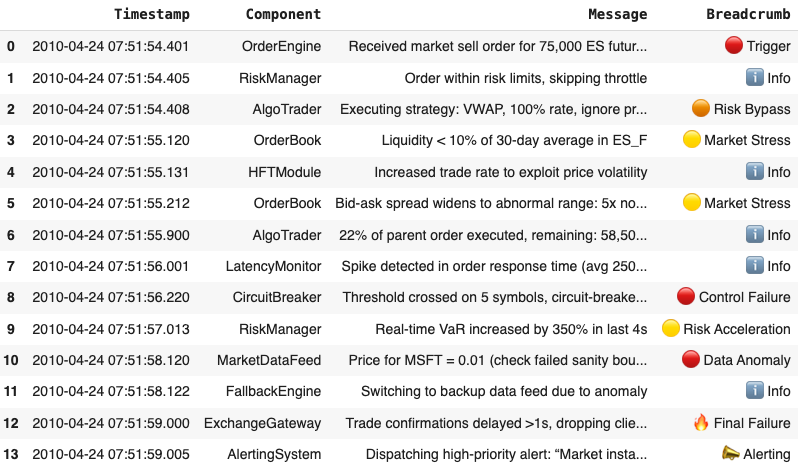

# Incident Tracing

A real-world example of a long breadcrumb trail before a system or application failure is the 2010 Flash Crash of the U.S. stock market. It shows how subtle signals, delayed feedback loops, and ignored edge conditions can silently accumulate before catastrophic failure—exactly what long breadcrumbs represent.

🧵 Case: 2010 Flash Crash (U.S. Stock Market, May 6, 2010)
💡 In a span of about 36 minutes, the Dow Jones Industrial Average plunged nearly 1,000 points (about 9%) and then mostly recovered, all during regular trading hours. It wiped out nearly $1 trillion in market value, temporarily.

🔍 Breadcrumb Trail (Leading Indicators)
1. Fragile Market Structure:
- High reliance on algorithmic and high-frequency trading (HFT).
- Market makers were already reducing risk exposure due to global instability (Greek debt crisis).

2. Liquidity Thinning:
- Order books were shallow; many traders had pulled out of the market.
- This increased sensitivity to large trades.

3. Large Sell Algorithm Activated:
- A mutual fund used an automated algorithm to sell 75,000 E-mini S&P contracts (valued at ~$4.1B).
- The algo was set to "trade as fast as possible without regard to price or time".

4. HFT Feedback Loops:
- HFTs started to withdraw liquidity after detecting rising volatility.
- Other HFTs began trading aggressively against each other, creating volume but no stability.

5. Price Free-Fall Triggers More Selling:
- ETFs and other securities began trading at absurd prices (e.g., Procter & Gamble dropped from ~$60 to $0.01/share briefly).
- Stop-loss orders and margin calls caused a cascade of auto-sells.

6. Delayed Recognition:
- Regulators and exchanges only began to react after the worst part had occurred.
- Circuit breakers and kill-switch logic were not yet fine-tuned for ultra-fast events.


📉 Failure Event
Markets lost nearly 9% in minutes, with trades occurring at extreme and irrational values. Recovery took 15–20 minutes—but confidence in automated trading was permanently impacted.

🎯 Why It’s a Good Example:
- Breadth: Involves multiple subsystems (algo trading, HFT, liquidity modeling, human oversight).
- Depth: Each breadcrumb was subtle but compounding—market fragility, risk algorithms, microsecond-level feedback loops.
- Latency: The system failed long after the first issue appeared. Problems like thinning liquidity were visible but not acted upon.
- Recoverability: The market rebounded, but the trust and understanding of market behavior took years to rebuild.

🧠 Lessons:
- Long breadcrumbs often masquerade as normal behavior in complex adaptive systems.
- Look for small signal decay: latency increases, thinning liquidity, rising retries, growing queue depths, or systemic "reflexes" like panic selling.
- Build observable systems with fail-soft designs and active monitoring of systemic drift.
- Breadcrumbs are weak signals—but in combination, they form an alarm bell pattern. The key is to correlate across:
	- Dimensions (latency, liquidity, execution),
	- Time (progression),
	- Responsibility (which component failed to act).

Once you structure your logs into a timeline with intent and consequence, you can build resilient systems that don't just crash silently.

To breadcrumb a failure:
- Capture event timestamps — show a timeline.
- Tag log levels and origin — identify which subsystem emits the signal.
- Highlight abnormalities — look for:
	- abnormal inputs (🔴),
	- bypassed controls (🟠),
	- stress signs (🟡),
	- unhandled anomalies (🔥).
	```
	🔴 Trigger → Order event kicks off the cascade.
	🟠 Risk Bypass → Strategy ignores limits or timing, creating vulnerability.
	🟡 Market Stress → Liquidity crunch + abnormal spreads indicate instability.
	🔴 Control Failure → Circuit-breakers fail to activate; protective systems passive.
	🟡 Risk Acceleration → Risk metrics spike (VaR).
	🔴 Data Anomaly → Nonsensical prices (e.g., MSFT = 0.01) suggest feed corruption.
	🔥 Final Failure → Exchange drops sessions; systemic collapse.
	📣 Alerting → Final warning dispatched after critical loss of control.
	```
- Summarize the causal path in a readable format (like the table above).
- Use symbols to make signal strength and severity more visually intuitive.



<hr>
To transform this into a real-time alerting pipeline and produce visualizations (HTML dashboard, CSV, plots), break it down into these deliverables:

✅ Overview
🔧 Real-Time Alerting Stack:
| Component								  | Purpose								 |
|:----------------------------------------|-------------------------------------:|
| Log Shipper (Filebeat)				  |	Watches log files and forwards data  |
| Log Storage (Elasticsearch)			  |	Stores and indexes logs 			 |
| Visualization (Kibana)				  |	Real-time dashboard and search 		 |
| Alerting (Elasticsearch/Kibana Watcher) |	Triggers on critical errors 		 |
| Metrics (Prometheus)					  |	Collects & scrapes log metrics 		 |
| Visualization (Grafana)				  |	Plots metrics, trends, KPIs 		 |


🔌 Step 1: Set up Filebeat to ship logs to Elasticsearch
filebeat.yml minimal config:

```
filebeat.inputs:
  - type: log
    enabled: true
    paths:
      - /var/log/system_trace.log

output.elasticsearch:
  hosts: ["http://localhost:9200"]
  index: "system-logs"

setup.kibana:
  host: "localhost:5601"

```

📦 Place this config in /etc/filebeat/filebeat.yml, and run:

```
sudo filebeat setup
sudo systemctl start filebeat
```

🔎 Step 2: Alerting in Kibana
Create a Watcher Alert or Kibana rule:

```
{
  "trigger": {
    "schedule": { "interval": "10s" }
  },
  "input": {
    "search": {
      "request": {
        "indices": ["system-logs"],
        "body": {
          "query": {
            "match": { "message": "CRITICAL" }
          }
        }
      }
    }
  },
  "actions": {
    "log_error": {
      "logging": {
        "text": "🔥 Critical Error Detected: {{ctx.payload.hits.hits.0._source.message}}"
      }
    }
  }
}

```

📊 Step 3: Prometheus Integration (Metrics)
Expose metrics from your Python parser using Prometheus client:
```
from prometheus_client import start_http_server, Gauge
import time
import re

critical_errors = Gauge('critical_errors_total', 'Total number of critical errors')
error_rate = Gauge('error_rate', 'Rate of errors per minute')

log_pattern = re.compile(r'\[(.*?)\]\s+(\w+)\s+-\s+\[(.*?)\]\s+(.*)')

def monitor_log(filepath):
    seen = set()
    while True:
        with open(filepath, 'r') as f:
            lines = f.readlines()
        new_critical = [line for line in lines if "CRITICAL" in line and line not in seen]
        seen.update(new_critical)

        critical_errors.set(len(seen))
        error_rate.set(len(new_critical))
        time.sleep(5)

if __name__ == "__main__":
    start_http_server(8000)  # Prometheus scrapes from here
    monitor_log("system_trace.log")

```
📡 Add to prometheus.yml:
```
scrape_configs:
  - job_name: 'log_monitor'
    static_configs:
      - targets: ['localhost:8000']

```

📈 Step 4: Grafana Dashboard Example
Add a Grafana panel to visualize:
- critical_errors_total
- error_rate

Panel Titles:
✅ 🔥 Critical Errors Count
📈 Error Spike Trend (per minute)


📁 Step 5: Export to CSV & HTML Plot with Python
```
import pandas as pd
import matplotlib.pyplot as plt

df = pd.read_csv("system_trace.log", sep=' - ', engine='python', header=None, names=["timestamp", "level", "component_message"])
df['timestamp'] = pd.to_datetime(df['timestamp'].str.strip('[]'))

# Filter critical
df_critical = df[df['level'].str.contains("CRITICAL|ERROR")]

# Save to CSV
df_critical.to_csv("critical_breadcrumbs.csv", index=False)

# Plot
plt.figure(figsize=(10, 5))
df_critical['timestamp'].dt.minute.value_counts().sort_index().plot(kind='bar')
plt.title("🔥 Critical Events per Minute")
plt.xlabel("Minute")
plt.ylabel("Count")
plt.tight_layout()
plt.savefig("critical_errors_plot.png")

```

🌐 HTML Dashboard (Lightweight)
```
html = df_critical.to_html(classes="table table-striped", index=False)
with open("critical_dashboard.html", "w") as f:
    f.write("""
    <html><head><link rel="stylesheet" href="https://cdn.jsdelivr.net/npm/bootstrap@5.3.0/dist/css/bootstrap.min.css"></head>
    <body>
    <div class='container'>
    <h2>🔥 Critical Error Dashboard</h2>
    """ + html + """
    </div></body></html>
    """)

```

🚀 Summary
✅ Real-time alerting (Filebeat + Elasticsearch + Watcher)
✅ Metrics for Prometheus + Grafana
✅ CSV & HTML reports
✅ Python-based plot for quick review

<hr>

🐳 Complete Dockerized ELK + Prometheus + Grafana Pipeline
✅ 
📦 Filebeat: Watches logs from host or container
🔍 Elasticsearch: Stores logs
📊 Kibana: Visual dashboard and alerts
📈 Prometheus: Scrapes Python metrics from log analyzer
📺 Grafana: Visualizes error rates and trends
🐍 Python Log Analyzer: Streams metrics and exports CSV/HTML


📁 Project Structure
```
log-pipeline/
│
├── docker-compose.yml
├── elasticsearch/
│   └── Dockerfile
├── filebeat/
│   └── filebeat.yml
├── prometheus/
│   └── prometheus.yml
├── grafana/
│   └── provisioning/ (optional: datasources, dashboards)
├── python-analyzer/
│   ├── analyzer.py
│   └── system_trace.log
└── dashboards/
    └── critical_dashboard.html

```

🧱 docker-compose.yml
```
version: '3.8'

services:
  elasticsearch:
    image: docker.elastic.co/elasticsearch/elasticsearch:7.17.0
    environment:
      - discovery.type=single-node
      - xpack.security.enabled=false
    ports:
      - "9200:9200"

  kibana:
    image: docker.elastic.co/kibana/kibana:7.17.0
    ports:
      - "5601:5601"
    depends_on:
      - elasticsearch

  filebeat:
    image: docker.elastic.co/beats/filebeat:7.17.0
    volumes:
      - ./filebeat/filebeat.yml:/usr/share/filebeat/filebeat.yml
      - ./python-analyzer/system_trace.log:/var/log/system_trace.log
    depends_on:
      - elasticsearch

  python-analyzer:
    build: ./python-analyzer
    ports:
      - "8000:8000"
    volumes:
      - ./python-analyzer:/app

  prometheus:
    image: prom/prometheus
    volumes:
      - ./prometheus/prometheus.yml:/etc/prometheus/prometheus.yml
    ports:
      - "9090:9090"

  grafana:
    image: grafana/grafana
    ports:
      - "3000:3000"
    volumes:
      - grafana-storage:/var/lib/grafana

volumes:
  grafana-storage:

```

📜 filebeat/filebeat.yml
```
filebeat.inputs:
  - type: log
    enabled: true
    paths:
      - /var/log/system_trace.log

output.elasticsearch:
  hosts: ["http://elasticsearch:9200"]
```

🐍 python-analyzer/analyzer.py
```
from prometheus_client import start_http_server, Gauge
import time
import re

critical_errors = Gauge('critical_errors_total', 'Total number of critical errors')
error_rate = Gauge('error_rate', 'Rate of errors per minute')

log_pattern = re.compile(r'\[(.*?)\]\s+(\w+)\s+-\s+\[(.*?)\]\s+(.*)')

seen = set()

def monitor_log(filepath):
    while True:
        with open(filepath, 'r') as f:
            lines = f.readlines()
        new_critical = [line for line in lines if "CRITICAL" in line and line not in seen]
        seen.update(new_critical)

        critical_errors.set(len(seen))
        error_rate.set(len(new_critical))
        time.sleep(5)

if __name__ == "__main__":
    start_http_server(8000)
    monitor_log("system_trace.log")
```

🧾 prometheus/prometheus.yml
```
global:
  scrape_interval: 5s

scrape_configs:
  - job_name: 'python-analyzer'
    static_configs:
      - targets: ['python-analyzer:8000']
```

🐍 python-analyzer/Dockerfile
```
FROM python:3.10-slim

WORKDIR /app
COPY . .

RUN pip install prometheus_client pandas matplotlib

CMD ["python", "analyzer.py"]
```

▶️ Run Everything
```
docker-compose up --build
```

🔎 Access Your Services
| Service		 | URL  							|
|:---------------|---------------------------------:|
| Kibana		 | http://localhost:5601			|
| Prometheus	 | http://localhost:9090			|
| Grafana		 | http://localhost:3000			|
| Python metrics | http://localhost:8000/metrics	|

Default Grafana login: admin / admin

📈 Optional: Add Grafana Dashboard
You can provision a dashboard using grafana/provisioning/dashboards/ and add:
- critical_errors_total
- error_rate

