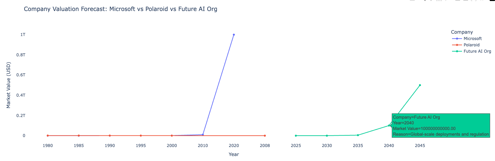
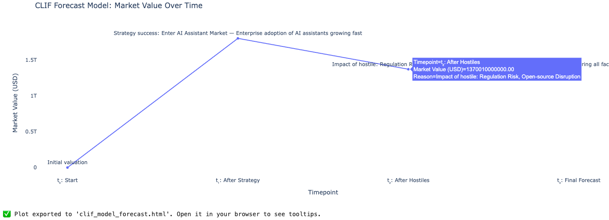

# Reverse-Engineering Market Valuation

Reverse-engineering market value from historical inflection points — when giants were underestimated or dependent — to build a framework for forward-looking valuation grounded in underlying principles rather than momentary dominance.

## 🔄 Concept: Backwards Market Valuation
Instead of asking “what is this company worth today?”, ask:
“If I had known what I now know, what would it have been worth then?”

🧠 Case Studies
### 🧾 1. Microsoft "working for" Apple (Late 1970s–Early 1980s)
**Context**: Microsoft provided software (like BASIC and later Office) for Apple computers. At that point, Apple was hardware, Microsoft was just a vendor.

**Hidden Value in 1980s**: Platform-agnostic model (Windows > single-vendor OS)

Early dominance in developer ecosystem

**Backward Valuation Insight**: If we had mapped 
- software leverage 
- OS scale potential 
- Dawn of the Internet Era, 

we’d have valued Microsoft more highly than its role as a supplier implied.

### 🧾 2. Honda was rejected by Toyota (1940s–1950s)
**Context**: Soichiro Honda’s piston rings failed to meet Toyota's standards. He pivoted, innovated, and ultimately led a mobility revolution.

**Hidden Value in 1950s**: Obsession with engineering perfection
- Small-engine tech → motorcycles → global low-cost autos

**Backward Valuation Insight**: A small, hungry disruptor with manufacturing insight + engineering culture was underpriced.

## 🧮 How to Formulate Market Valuation (From These Lessons)
**Step 1: Identify Non-Obvious Leverage**
- What structural asymmetries does this company possess?
	- Platform or ecosystem control?
	- Asymmetric cost of scale?
	- Compounding effects over time (data, network, IP)?

**Step 2: Trace Counterfactual Growth Paths**
- Ask: “If this grows as its model implies, what dominant incumbents does it displace or complement?”
- Use hindsight: If Apple needs Microsoft → Microsoft is not merely a supplier, it's a gatekeeper.

**Step 3: Look at Cultural and Operational DNA**
- Rejections often come from misfit with incumbents.
- Rejected founders (e.g., Honda, Bezos, Musk) often:
	- Prioritize long-term product over short-term returns
	- Reinvent markets, not just compete in them

**Step 4: Evaluate Real Options / Strategic Surface Area**
- Early-stage Microsoft had “options” on OS, Office, cloud.
- Honda had “options” on low-cost transport, motorcycles, scooters, compact cars.
- These optionalities do not show up in conventional DCFs or comps.

**Step 5: Discount the Market’s Myopia**
- The market is often too focused on current product revenue.
- True valuation lies in future dominance + control over a leverage point (e.g., standards, ecosystems, infra).

## 📐 Formulated Model: Reverse Market Valuation Formula
```
MV(t₀) = f(
  Platform Leverage (PL),
  Ecosystem Control (EC),
  Cultural Resilience (CR),
  Strategic Options (SO),
  Misunderstood Potential (MP)
)
```

```
Where:
PL = ability to extract rents from platforms (like OS, cloud infra)
EC = control over developer, supplier, or distribution networks
CR = ability to survive rejection and innovate regardless
SO = embedded “calls” on future markets
MP = undervaluation by incumbents or market
```

✅ Application
Use this model to:
- Spot undervalued firms now
- Explain retroactive mispricings
- Design better investment theses

<hr>

## 🧠 Key Premise
Companies like Microsoft or Honda weren’t just “underdogs” — they were **owning leverage in overlooked systems**. The market around them hadn’t been fully formed yet.

To estimate a market 10–20 years out, we must look for **nascent leverage points** today with the potential to birth **entire industries or remap existing ones**.

## 🔍 Historical Pattern ⇒ Valuation Jump
| Company   | Era of Obscurity | Key Leverage               | Then-Valuation | 20-Year Later Market           |
| --------- | ---------------- | -------------------------- | -------------- | ------------------------------ |
| Microsoft | 1980s            | Platform + developer infra | <\$1B          | \~\$2.5T (2024)                |
| Honda     | 1950s            | Small-engine innovation    | <\$100M        | \~\$50B–\$100B+ (auto + power) |
| Nvidia    | 2000s            | GPU as general compute     | \~\$1B         | \~\$2.3T (2024)                |
| Amazon    | Late 90s         | Infra + logistics culture  | \~\$500M       | \~\$1.9T (2024)                |

Average multiplier: 1,000x – 10,000x if the underlying tech remaps an industry.

### 📈 Forecast: Future $10T+ Market Segments (2035–2045)
1. Personalized Autonomous Intelligence ($10–20T)
(Parallel: Microsoft → OS platform → economy-wide value)
- Tools that personalize your AI across health, career, memory, relationships
- Ties to edge compute, data ownership, and AI identity
- Today's underdog: Startups like Rewind, Humane, or open-source agents
- Est. future market size:
	- 5B people × $500/year spend = $2.5T/year recurring
	- Market cap at 10× earnings ⇒ $25T industry

2. Human-Cloud Biocomputation ($5–10T)
(Parallel: Nvidia’s general compute vision from a gaming GPU)
- DNA as data + synthetic biology for distributed production (proteins, energy, etc.)
- Undervalued lever: Organ-on-chip + distributed gene editing
- Current players: Ginkgo Bioworks, OpenCell, low-cap university spinouts
- Est. future valuation:
	- $1T/year production potential × 5–10× multiple = $5–10T

3. Energy Storage + Transmission Redesign ($10–15T)
(Parallel: Honda → small engine → transportation rewrite)
- Long-duration energy storage (thermal, hydrogen, gravity, flow batteries)
- Decentralized grid software + P2P energy markets
- Undervalued now: Amprius, Form Energy, small-grid infra startups
- Future market:
	- Global energy spend >$10T/year; even 10–20% replaced = $1–2T/year revenue
	- Capturable market cap: $10–15T

4. Machine-Interfaced Economy ($5–8T)
(Parallel: Microsoft OS → interface between humans and computers)
- BCI (brain-computer), haptic interfaces, machine intuition systems
-  Today’s version: Neuralink, Valve Index, NextMind, startups in gesture sensing
-  Long tail: accessibility, cognition, workforce augmentation
-  10-year outcome:
	- $500B/year in productivity gains × 10–15× multiple = $5–8T

We can expect multiple $5T–$25T markets to emerge by 2035–2045 based on:
| Market Area                      | Future Valuation Estimate |
| -------------------------------- | ------------------------- |
| Personalized AI Identity         | \$10–25T                  |
| Biocomputation Infrastructure    | \$5–10T                   |
| Post-Battery Energy Architecture | \$10–15T                  |
| Brain/Machine Interface Economy  | \$5–8T                    |

## ➕ Strategy:
If we **back-calculate** Microsoft in 1980 or Honda in 1950, we would price these opportunities **by the leverage they possess, not by revenue they report**.

Here we model a formal framework that:
1. Models a company’s **potential future market value** even from a **near-zero** or **early-stage base**.
2. Captures **2 divergent futures**: 
	- 1 where the company pivots/executes wisely (e.g., Polaroid → Digital), and 
	- 1 where it fails (Polaroid → Bankruptcy).
3. Includes **conditional reasoning**, not just deterministic forecasting.

# Conditional Leverage-Inflection Forecast (CLIF)
## 🧩 Framework: Conditional Future Valuation Model

Model the future market value as: 𝑀𝑉_{𝑓𝑢𝑡𝑢𝑟𝑒} = 𝑀𝑉_0 + Σ [ 𝑃_𝑖 × ( 𝐿_𝑖 × 𝑀_𝑖 × 𝐺_𝑖 ) ]

```
MV_future = MV_0 + Σ [ P(strategy_i) × (Leverage_i × MarketSize_i × Growth_i) ]
```

where on strategy_i
| Symbol | Description                                                |
| ------ | ---------------------------------------------------------- |
| `MV_0` | Current Market Value (can be \~0 or minimal)               |
| `P_i`  | Probability of strategic inflection point being executed   |
| `L_i`  | Leverage potential of that strategy (0 to ∞ scale)         |
| `M_i`  | Market size associated with that strategy                  |
| `G_i`  | Growth multiplier (network effects, platform, scale, etc.) |

## 📉 Introducing Hostile Conditionals: Negative Impact Factors

```
MV_future = MV_0 + Σ [ P(strategy_i) × (Leverage_i × MarketSize_i × Growth_i) ]
				- Σ [ (Hostile_i × Damage_i × Financial_i) ]
```

where on condition_j
| Symbol | Meaning                                                                |
| ------ | ---------------------------------------------------------------------- |
| `H_j`  | Probability of hostile condition `j` occurring (e.g., disruption, law) |
| `D_j`  | Degree of damage (0–1) if it occurs                                    |
| `F_j`  | Financial exposure (\$ impact) of that condition                       |


<hr>

### 🧪 Case Example: Polaroid (1995)
#### ❌ Path 1: Did Not Pivot → Bankruptcy
- MV_0 = ~$2B (1995)
- P_digital_camera = 0.05 (ignored it)
- L_camera = 0 (no IP or ecosystem scaled)
- M_camera = $100B (global market they could have entered)
- G_camera = 0.2 (others like Canon/Nikon captured it)

MV_future = $2B + 0.05 × (0 × $100B × 0.2) = $2B
Eventually declined toward $0.

#### ✅ Path 2: Hypothetical Pivot to Digital Imaging
Assume:
- P_digital_camera = 0.7 (had they acted on it)
- L_camera = 0.6 (strong brand, image processing, supply chains)
- M_camera = $100B (total market)
- G_camera = 2 (platform for mobile photo, cloud, maybe even Instagram-like)

MV_future = $2B + 0.7 × (0.6 × $100B × 2) = $2B + 0.7 × $120B = $2B + $84B = $86B
Polaroid could’ve been a $50B–$100B company today, rivaling Canon or GoPro or even evolving into part of Apple’s photo ecosystem.

**2 outcomes** modeled as:
| Scenario         | Description                      | Final MV Outcome     |
| ---------------- | -------------------------------- | -------------------- |
| ❌ Inaction       | Failed to pivot                  | Near-zero (\$0–\$2B) |
| ✅ Wise Execution | Leveraged into growth inflection | \$50B–\$100B+        |

### 🔄 How to Use This Model Today
Example: AI Agent Startup (2025)
- MV_0 = $10M (early seed stage)
- P_i = 0.6 (chance it reaches agent maturity)
- L_i = 0.3 (they own a memory-embedding advantage)
- M_i = $2T (future AI personal assistant market)
- G_i = 5 (high growth via device + platform integration)

MV_future = $10M + 0.6 × (0.3 × $2T × 5) = $10M + 0.6 × $3T = $1.8T
Even from near-zero, this shows trillion-dollar potential, only if they execute.

### 🧮 Conditional Divergence Summary
| Component         | ❌ Failure Case         | ✅ Successful Case            |
| ----------------- | ---------------------- | ---------------------------- |
| P\_strategy       | Low                    | High                         |
| Leverage          | Weak / ignored         | Actively scaled              |
| Market Mapping    | Absent / misunderstood | Timely + product aligned     |
| Growth Multiplier | Lost to competitors    | Internalized (platformized)  |
| Final Valuation   | Erosion to 0           | Compounded exponential value |

### 🔁 Feedback Loop
Use the formula not just as a forecast, but as a strategy tool:
- Test “what if” pivots
- Estimate cost of inaction
- Convince boards/investors via quantified paths

## Conditional Leverage-Inflection Forecast (CLIF) framework
Conditional Leverage-Inflection Forecast (CLIF) framework incorporates both positive strategic factors and negative hostile conditions. 

Using the refined formula by introducing negative conditionals— called hostile conditions—that subtract or diminish the potential future value. This gives a balanced outcome between opportunity and threat, or:
**Strategic Optionality – Hostile Exposure = Forecasted Outcome**

### 🧪 Case Study (Updated): Polaroid with Hostile Factors
Let’s reanalyze the Polaroid alternate future including hostile risk of being disrupted by phones.

✅ Pivot to Digital Path:
- MV_0 = $2B
- P_digital = 0.7
- L_camera = 0.6
- M_camera = $100B
- G_camera = 2

📈 Positive Component:
	+ 0.7 × 0.6 × $100B × 2 = +$84B

🧨 Hostile Condition:
Smartphone convergence cannibalizes point-and-shoots
- H_phone_disruption = 0.8
- D_impact = 0.5 (they lose 50% share)
- F_exposure = $50B of their reachable TAM

📉 Negative Component:
	− 0.8 × 0.5 × $50B = −$20B

Final:
```
MV_future = $2B + $84B − $20B = $66B
```
Still a huge win, but not without risk properly factored.

###  🔁 Example: Modern AI Agent Company (2025)
📈 Positives:
- MV_0 = $10M
- P = 0.6 (success at building agent platform)
- L = 0.3
- M = $2T
- G = 5

→ Positive Term = 0.6 × 0.3 × $2T × 5 = $1.8T

🧨 Hostile Scenarios:
j=1: Regulatory AI Cap Risk
- H₁ = 0.5
- D₁ = 0.6
- F₁ = $500B
→ - 0.5 × 0.6 × $500B = -$150B

j=2: Open-source competitor disrupts moat
- H₂ = 0.7
- D₂ = 0.4
- F₂ = $1T
→ - 0.7 × 0.4 × $1T = -$280B

Final Forecast:
```
MV_future = $10M + $1.8T - $150B - $280B = ~$1.37T
```
Still massive—but now realistic, with conditional downside.

| Purpose                     | Example                                                                |
| --------------------------- | ---------------------------------------------------------------------- |
| **Startup Forecasting**     | Identify how big the upside could be and what *could kill it*          |
| **Turnaround Planning**     | Model how a failing firm (e.g., Nokia, Blackberry) could’ve pivoted    |
| **Strategic Investment**    | VC/PE modeling whether to invest or not                                |
| **Policy/Defense Strategy** | Model risk of hostile nations or legal interventions damaging a market |


Polariod should have used it to forecast that had they should had gone into digital camera business, instead of bankrupting - ending as 0, their story would have been different today. We show that there are 2 different outcomes with the formulation so we can use it to model a forecast.

<hr>
Program includes an interactive plot where hovering over each point displays annotations explaining the data.

<hr>
Visualizes:
	- Microsoft 🟢 or 🟩: A strong growth trajectory with key historical milestones.
	- Polaroid 🔴 or 🟥: A decline into bankruptcy due to failure to adapt to digital trends.
	- Future AI Org 🔵 or 🟦: A forecast of success based on technological adoption and scaling.

Each point includes hoverable reasons for valuation change.



